# Quick Notes

A full-stack note-taking web application built with **FastAPI**, **PostgreSQL**, and **Vanilla JavaScript**, designed to help users organize notes, notebooks, folders, and bibliographic references.

## Live Demo

**Application:** https://your-render-app.onrender.com

## GitHub Repository

https://github.com/josedanieltiradoramirez/quick-notes-app

---

## About the Project

Quick Notes is a personal knowledge management application that allows users to create, organize, and manage notes using notebooks, folders, bibliographies, and tags.

This project was developed as a portfolio project to demonstrate full-stack development skills, including backend API development, authentication, relational database design, frontend development, and cloud deployment.

---

## Features

### Authentication

* User registration
* User login
* JWT authentication
* Protected API endpoints
* User-specific data isolation

### Notes

* Create, edit, and delete notes
* Search notes
* Associate notes with notebooks
* Associate notes with folders
* Associate notes with bibliographies

### Notebooks

* Create, edit, and delete notebooks
* Organize notes into notebooks
* Notebook filtering

### Folders

* Create, edit, and delete folders
* Organize notes into folders
* Folder filtering

### Bibliographies

* Create, edit, and delete bibliographies
* Associate notes with bibliographic references
* Bibliography filtering

### Additional Features

* Tag system
* Dynamic filtering
* Modal-based UI
* Responsive design
* Database migrations with Alembic

---

## Tech Stack

### Backend

* FastAPI
* SQLAlchemy
* Alembic
* PostgreSQL
* JWT Authentication
* Passlib
* Python-Jose

### Frontend

* HTML5
* CSS3
* Vanilla JavaScript
* Jinja2 Templates

### Database

* PostgreSQL

### Deployment

* Render Web Service
* Render PostgreSQL Database

---

## Database Design

The application uses a relational database design with:

* Users
* Notes
* Notebooks
* Folders
* Bibliographies
* Note-Notebook relationships
* Note-Bibliography relationships

Features include:

* One-to-many relationships
* Many-to-many relationships
* User ownership and authorization
* Database migrations using Alembic

---

## Authentication

Authentication is implemented using JWT (JSON Web Tokens).

The application supports:

* User registration
* User login
* Token generation
* Protected routes
* Authorization headers
* Automatic logout when tokens expire

---

## Screenshots

### Login

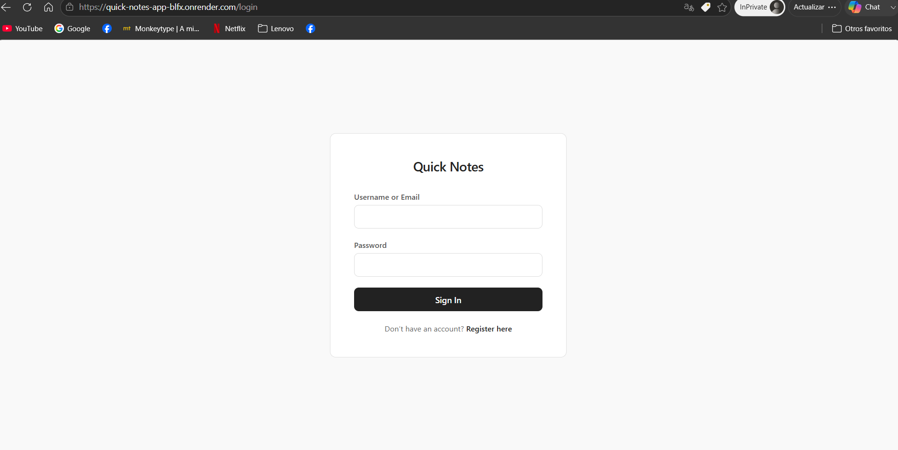

### Register 
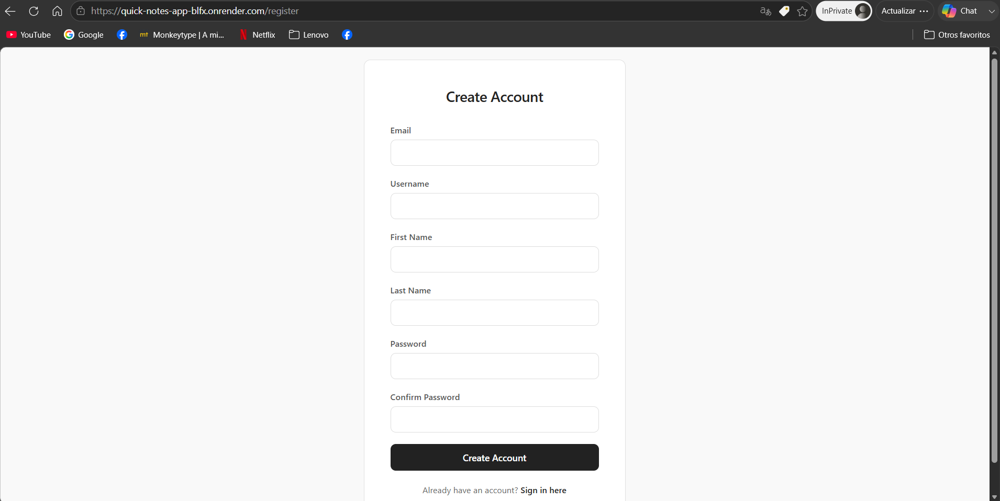

### All Notes view


### Notebooks View

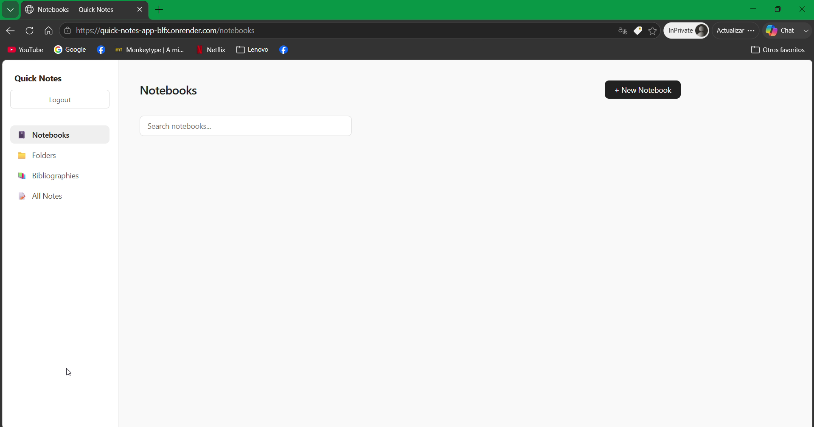

### Folders View

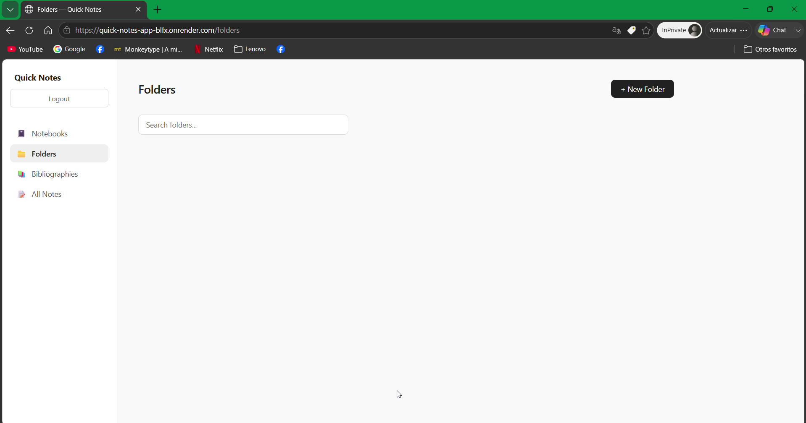

### Bibliographies View

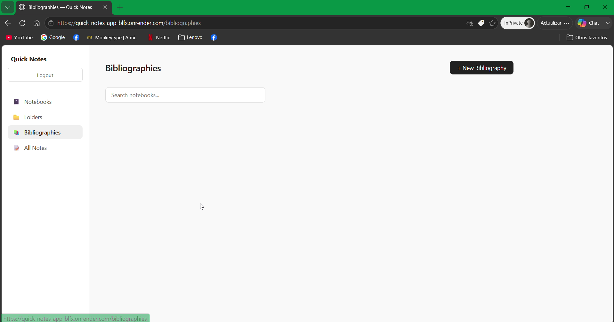

### New note creation

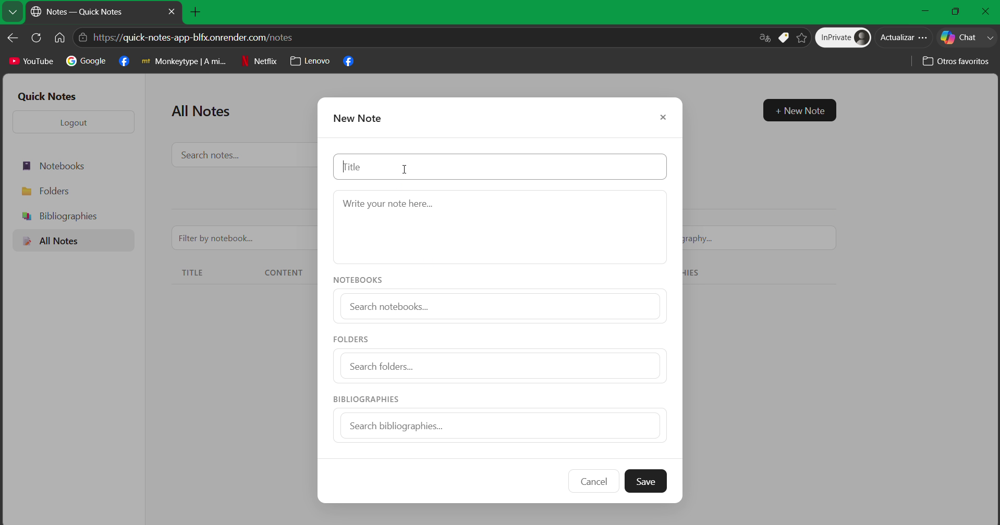

### Notes repository
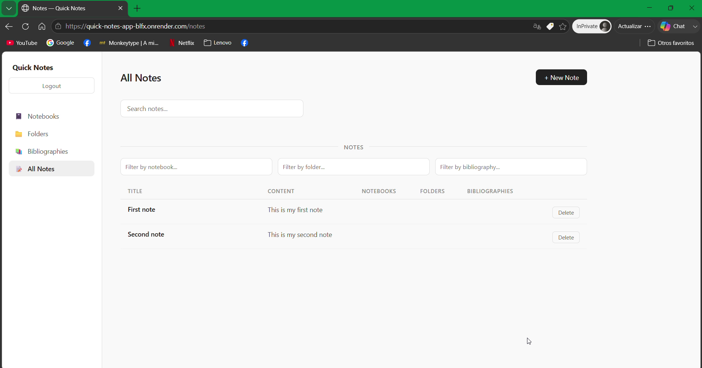

### New notebook creation

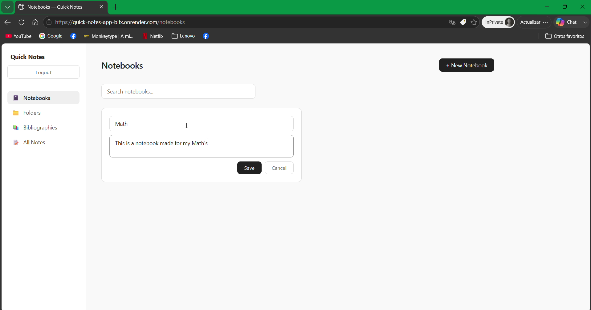

### Notebook inside notebook

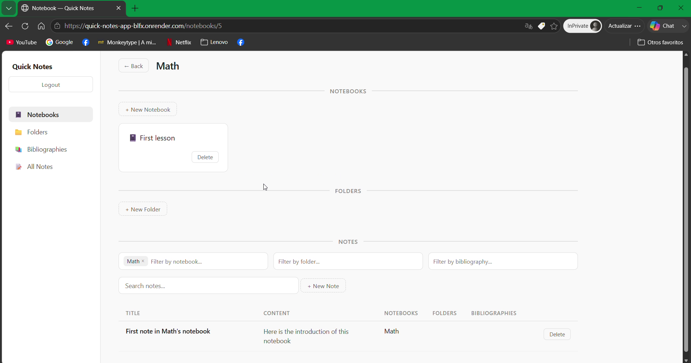

### New bibliography creation

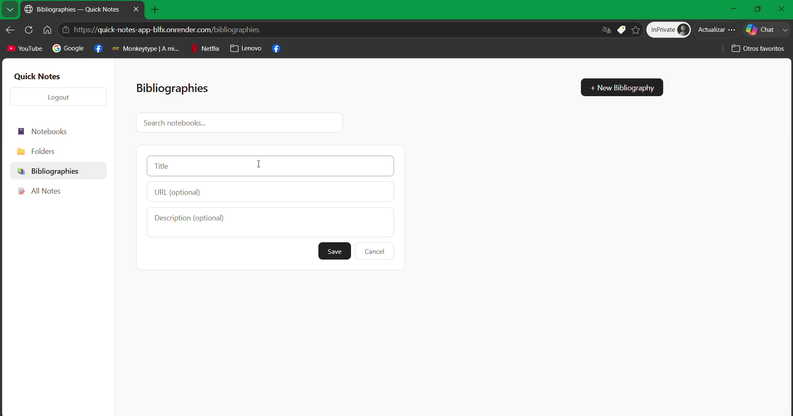

### Inheritance of properties

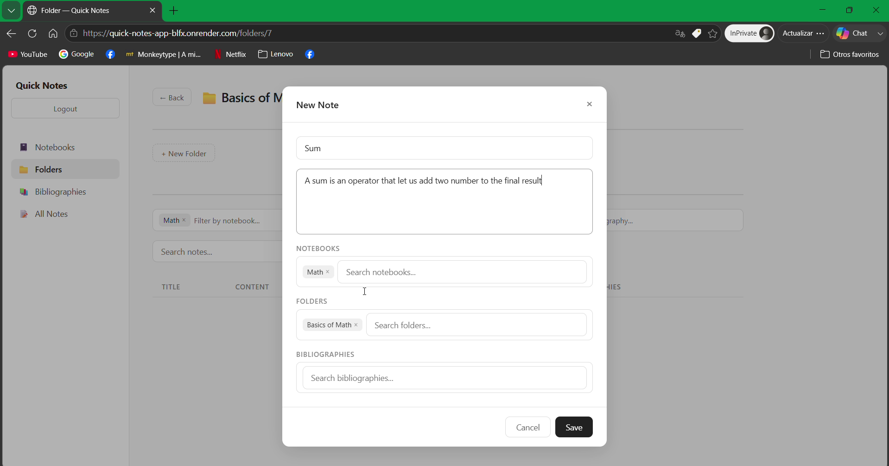

### Filters inheritance

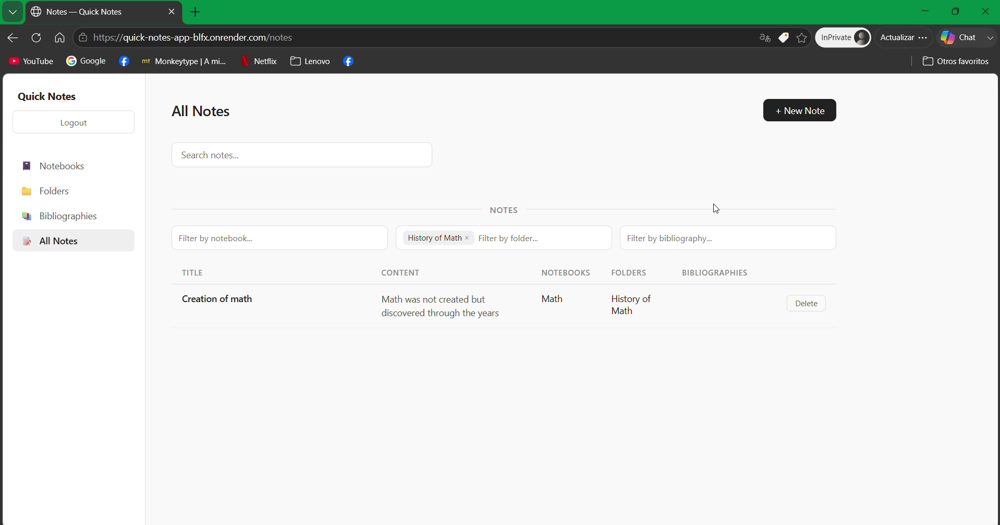

### Relation many to many

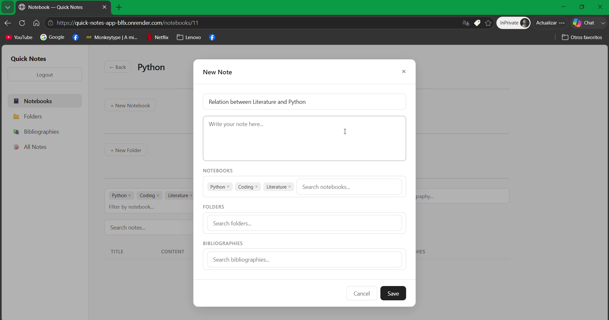

---

## Local Installation

Clone the repository:

```bash
git clone https://github.com/josedanieltiradoramirez/quick-notes-app.git
cd quick-notes-app
```

Create a virtual environment:

```bash
python -m venv venv
```

Activate the virtual environment:

### Windows

```bash
venv\Scripts\activate
```

Install dependencies:

```bash
pip install -r requirements.txt
```

Create a `.env` file:

```env
DATABASE_URL=your_database_url
SECRET_KEY=your_secret_key
```

Run migrations:

```bash
alembic upgrade head
```

Start the application:

```bash
uvicorn app.main:app --reload
```

Open:

```
http://127.0.0.1:8000
```

---

## What I Learned

Through this project, I gained practical experience with:

* REST API development using FastAPI
* JWT authentication and authorization
* SQLAlchemy ORM
* Database migrations using Alembic
* PostgreSQL database design
* Many-to-many relationships
* Frontend development with vanilla JavaScript
* Full-stack application deployment
* Cloud hosting using Render
* Git and GitHub workflows

---


## Author

**Jose Daniel Tirado Ramirez**

* GitHub: https://github.com/josedanieltiradoramirez
* LinkedIn: https://linkedin.com/in/josedanieltiradoramirez
